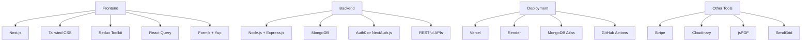

# Bilfora Tech Stack

## **Frontend**
1. **Framework**
   - React.js or Next.js (Preferred: Next.js for SSR and SEO)

2. **Styling**
   - Tailwind CSS (Rapid UI development)
   - Chakra UI (Optional: For accessible components)

3. **State Management**
   - Redux Toolkit (Complex state like user sessions and invoice data)
   - React Query or TanStack Query (Server-state management and caching)

4. **Forms & Validation**
   - Formik + Yup (For invoice creation and validation)

---

## **Backend**
1. **Framework**
   - Node.js with Express.js (Lightweight and flexible)
   - OR NestJS (For a more structured, TypeScript-first approach)

2. **Database**
   - MongoDB (NoSQL, for flexible schema like invoices and clients)
   - OR PostgreSQL (Relational database for structured data)

3. **Authentication**
   - Auth0 (Third-party login/signup solution)
   - OR Passport.js / NextAuth.js (Custom authentication)

4. **API**
   - RESTful APIs (Simpler implementation)
   - OR GraphQL (Flexible data fetching for invoices and clients)

---

## **Deployment & Hosting**
1. **Frontend**
   - Vercel (Optimized for Next.js)
   - OR Netlify (Alternative)

2. **Backend & Database**
   - AWS (EC2 for backend, RDS for PostgreSQL, or DynamoDB for NoSQL)
   - Render (Easy hosting for full-stack apps)
   - MongoDB Atlas (Managed cloud database)

3. **DevOps**
   - Docker (For containerization)
   - GitHub Actions (CI/CD)

---

## **Payment Integration**
1. **Stripe** (Preferred for payments, subscriptions, and invoices)
2. **PayPal SDK** (Optional additional payment option)

---

## **Other Tools**
1. **Email Service**
   - SendGrid or Postmark (For sending invoices via email)

2. **File Uploads**
   - Cloudinary or AWS S3 (For image/logo uploads)

3. **PDF Generation**
   - PDFKit or jsPDF (For generating invoice PDFs)

4. **Error Tracking**
   - Sentry (For monitoring production errors)

---

## **Suggested Stack Summary**
- **Frontend:** Next.js, Tailwind CSS
- **Backend:** Node.js (Express.js), MongoDB
- **Auth:** NextAuth.js
- **Payments:** Stripe
- **Deployment:** Vercel (frontend), Render (backend), MongoDB Atlas
- **PDFs:** jsPDF

---

## **Visual Representation**

Use this as a structured reference for building **Bilfora**. Let me know if you need further clarifications or adjustments.

