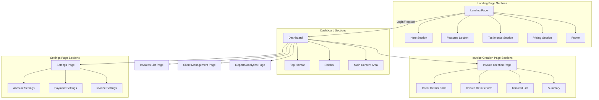

**Bilfora Freelance Invoicing Web App Page Layout**

---

### **1. Landing Page**

#### **Sections:**

-   **Hero Section:**

    -   Tagline: "Effortless Freelance Invoicing with Bilfora."
    -   Call-to-Action Buttons: "Get Started" and "Learn More."

-   **Features Section:**

    -   Highlights: Generating invoices, tracking payments, analytics, etc.

-   **Testimonial Section:**

    -   User reviews or success stories.

-   **Pricing Section:**

    -   Clear pricing tiers with feature comparisons.

-   **Footer:**

    -   Links: About, Contact, Privacy Policy, Social Media.

---

### **2. Dashboard (After Login)**

#### **Layout:**

-   **Top Navbar:**

    -   Logo
    -   Navigation Links: Dashboard, Invoices, Clients, Settings, Profile/Logout dropdown.

-   **Sidebar (Optional):**

    -   Links: Home, Create Invoice, View Invoices, Clients, Payments.

-   **Main Content Area:**

    -   **Overview Cards:** Total Earnings, Outstanding Payments, Recent Activity.
    -   **Quick Actions:** Prominent "Create Invoice" button.

---

### **3. Invoice Creation Page**

#### **Form Layout:**

-   **Client Details:**

    -   Dropdown or fields for client name, email, address.

-   **Invoice Details:**

    -   Fields: Invoice number, date, due date.

-   **Itemized List:**

    -   Dynamic rows to add items (description, quantity, price, total).

-   **Summary:**

    -   Auto-calculated: subtotal, tax, discounts, grand total.

#### **Actions:**

-   Buttons: Save as Draft, Send Invoice, Preview.

---

### **4. Invoices List Page**

#### **Features:**

-   **Table View:**

    -   Columns: Invoice Number, Client, Status (Paid/Pending/Overdue), Total Amount, Actions (View, Edit, Delete).

-   **Filters:**

    -   Options: Date range, status, client.

-   **Search Bar:**

    -   Quick lookup for specific invoices.

---

### **5. Client Management Page**

#### **Features:**

-   **Client List:**

    -   Table Columns: Client Name, Contact Info, Total Billed, Outstanding Balance.

-   **Add/Edit Client:**

    -   Modal or form to manage client details.

---

### **6. Reports/Analytics Page**

#### **Key Metrics:**

-   Total Earnings, Monthly Revenue, Most Active Clients.

#### **Graphical Representation:**

-   Bar charts, pie charts, or line graphs to visualize data.

#### **Export Option:**

-   Download reports as PDF/Excel.

---

### **7. Settings Page**

#### **Sections:**

-   **Account Settings:**

    -   Options: Update profile, email, password.

-   **Payment Settings:**

    -   Integrations: Connect Stripe/PayPal, add bank details.

-   **Invoice Settings:**

    -   Customization: Invoice templates, business logo, footer notes.

---

### **Design Focus**

-   **Consistency:**

    -   Reusable components like buttons and modals.

-   **Accessibility:**

    -   WCAG-compliant design.

-   **Responsive Design:**

    -   Optimized for desktop, tablet, and mobile views.

---

### Visual Representation Request

To create a reference diagram or mockup for the layout structure, specify whether you'd prefer a flowchart, wireframe, or hierarchical structure. Include details for preferred tools or formats (e.g., PDF, image).

find a

&#x20;so I can visualize the layout and the UI, create a wireframe or a flowchart that details each page, its sections, and the navigation between them. Use a clean and organized structure for easy reference.


## 1. Suggested File Structure


```bash
bilfora/
├── public/
│   ├── favicon.ico
│   ├── logo.svg
│   ├── assets/
│       └── images/
│           └── (static images for branding and illustrations)
├── src/
│   ├── components/
│   │   ├── Layout/
│   │   │   ├── Header.js
│   │   │   ├── Footer.js
│   │   │   └── Sidebar.js
│   │   ├── Navbar.js
│   │   └── (reusable UI components)
│   ├── pages/
│   │   ├── index.js  (Landing Page)
│   │   ├── dashboard/
│   │   │   ├── index.js  (Main Dashboard)
│   │   │   ├── invoices.js
│   │   │   ├── clients.js
│   │   │   ├── analytics.js
│   │   │   └── settings.js
│   │   ├── api/
│   │   │   └── (API routes for server-side operations, if needed)
│   ├── styles/
│   │   ├── globals.css  (Global styles)
│   │   ├── layout.css  (Layout-specific styles)
│   │   ├── components.css  (Component-specific styles)
│   ├── lib/
│   │   ├── utils.js  (Helper functions)
│   │   └── api.js  (Client-side API calls)
│   ├── context/
│   │   └── AuthContext.js  (Authentication context, if needed)
│   ├── hooks/
│   │   └── useInvoices.js  (Custom hooks for specific features)
│   ├── config/
│   │   └── constants.js  (Static values like API URLs or default configs)
│   ├── services/
│   │   └── invoiceService.js  (Functions to handle API requests for invoices)
└── package.json
```

---

## 2. Key Features and Considerations

### **Routing**
- Use Next.js pages for file-based routing:
  - `index.js` → Landing page.
  - `dashboard/index.js` → Main dashboard.
  - `dashboard/invoices.js` → Invoice listing.
  - `dashboard/clients.js` → Client management.
  - `dashboard/settings.js` → Settings page.
- Add dynamic routes for specific functionalities:
  - Example: `dashboard/invoices/[id].js` for viewing/editing specific invoices.

---

### **Styling**
- Use CSS Modules or libraries like **Tailwind CSS** for styling:
  - Tailwind simplifies responsive and utility-first design.
  - Define reusable class components in `globals.css`.

---

### **State Management**
- Leverage React Context or a state management library like **Zustand** for lightweight needs:
  - Example: Use `AuthContext` to handle authentication state.

---

### **API Integration**
- Use Next.js API routes for server-side functionality:
  - `pages/api/invoices.js`: Handle CRUD operations for invoices.
  - `pages/api/clients.js`: Manage client data.

---

### **Authentication**
- Use an authentication provider like **Auth0**, **NextAuth.js**, or custom JWT:
  - Secure routes and display the dashboard only after login.

---

### **Forms**
- Use a library like **React Hook Form** for handling forms:
  - Simplifies invoice creation, client addition, and settings updates.

---

### **UI Components**
- Build reusable components for a clean structure:
  - `Button.js`: A customizable button component.
  - `Card.js`: A card layout for analytics or overview.
  - `Modal.js`: For pop-ups like adding/editing clients.

---

## 3. Development Focus

### **MVP (Minimum Viable Product)**
#### Core Features:
- Invoice creation and tracking.
- Client management.
- Analytics overview.

#### Progressive Development:
1. Start with the landing page.
2. Add authentication and basic dashboard navigation.
3. Gradually implement features (invoices, clients, settings).

---

### **Responsive Design**
- Ensure all pages work seamlessly on mobile and desktop.

---

### **Performance**
- Use Next.js **Image Optimization** for assets.
- Enable **SSR (Server-Side Rendering)** or **Static Generation** for optimal performance.

---

### **Testing**
- Write tests using **Jest** and **React Testing Library** for components and logic.

---

## 4. Tools to Speed Development

- **UI Library**: Use component libraries like **Chakra UI** or **Material UI** for pre-styled components.
- **Database**: Use **Supabase** or **Firebase** for an easy backend, or **MongoDB** for more control.
- **Deployment**: Host with **Vercel** (perfect for Next.js).

---

## Final Notes

This structure and roadmap are designed to be beginner-friendly and scalable. Start small (Landing Page and Dashboard) and iteratively add features. Let me know if you'd like more details about any part!
